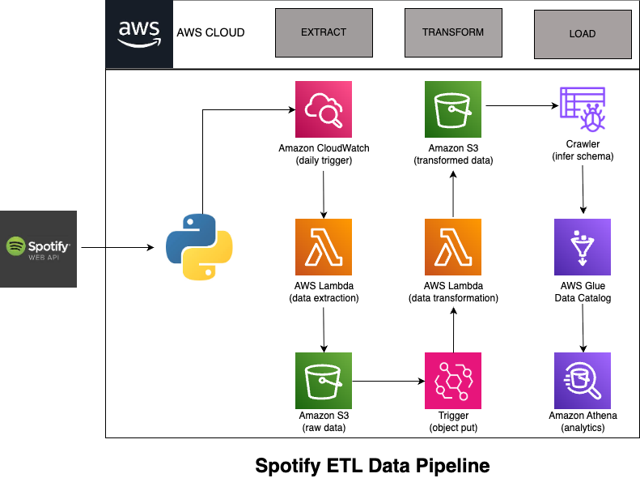

# 🎧 Spotify ETL Data Pipeline (AWS Serverless Architecture)

This project implements a complete **ETL data pipeline** that extracts track metadata from the Spotify API, transforms it using Python and AWS Lambda, stores the data in Amazon S3, and makes it queryable using AWS Athena. The entire pipeline is automated using **Amazon CloudWatch** and **S3 PutObject triggers**.

> ✅ **Note:** Due to Spotify API changes in 2024, only developer-registered playlists (like personal ones) are supported for data extraction.

---

---

## 📌 Features
- **Automated daily extraction** from a personal Spotify playlist using a Lambda function triggered by Amazon CloudWatch.
- **Raw data storage** in Amazon S3, organized as:
  - `raw_data/to_processed/`
  - `raw_data/processed/`
- **Transformation Lambda** (triggered on `ObjectPut`) parses and cleans:
  - `song`, `album`, and `artist` information
  - Handles bad/missing fields gracefully
- **Transformed data** stored back in S3 as CSVs under `transformed_data/`
- **AWS Glue Crawler** infers schema and catalogs datasets
- **Amazon Athena** enables querying with SQL
- **Cleanup**: Raw files are moved and `to_processed/` is cleared to prevent reprocessing

---

## 🧱 Tech Stack

| Layer | Tools Used |
|------|------------|
| Extract | Spotify API, AWS Lambda, CloudWatch |
| Transform | Python (Pandas), AWS Lambda |
| Load | Amazon S3, AWS Glue, Amazon Athena |
| Orchestration | CloudWatch Trigger, S3 Event Trigger |

---

## 📁 Folder Structure (S3 Buckets)

```
spotify-etl-project-sarthak1/
│
├── raw_data/
│   ├── to_processed/
│   └── processed/
│
└── transformed_data/
    ├── songs_data/
    ├── album_data/
    └── artist_data/
```

---

## ⚙️ AWS Services Used

- **AWS Lambda** – Two functions for extraction and transformation
- **Amazon S3** – Stores both raw and processed data
- **Amazon CloudWatch** – Triggers extraction daily
- **S3 Event Notification** – Triggers transformation on file upload
- **AWS Glue** – Crawls transformed data and catalogs schema
- **Amazon Athena** – SQL-based querying on cataloged datasets

---

## 📸 Project Screenshots

Screenshots included in the `screenshots/` folder:
- S3 Bucket structure
- CloudWatch trigger configuration
- Lambda functions
- S3 trigger on object put
- Glue crawler setup
- Athena query results
- Architecture Diagram

---

## 📦 Files Included

- `Spotify Data Pipeline Project.ipynb` – initial notebook for local prototyping
- `spotify_api_data_extract.py` – Lambda function code for data extraction
- `spotify_transformation_load_function.py` – Lambda function code for transformation & load
- `Spotify Data Pipeline.drawio.png` – architecture diagram

---


  
